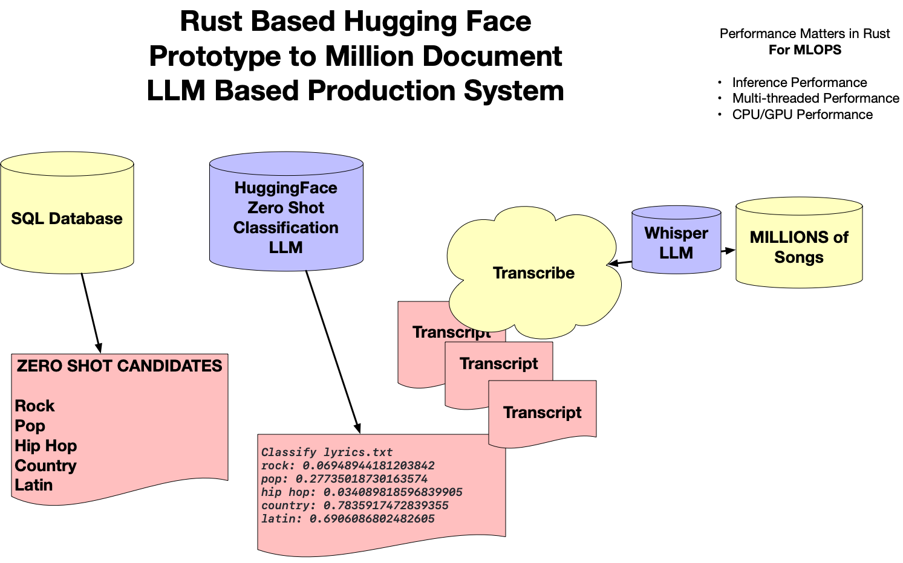

# Analyse lyrics of a song with Rust and Hugging Face SQLite



```
cargo run -- candidates
    Finished `dev` profile [unoptimized + debuginfo] target(s) in 0.13s
     Running `target/debug/sqlite-huggingface candidates`
rock
pop
hip hop
country
latin
```

```
cargo run -- lyrics
    Finished `dev` profile [unoptimized + debuginfo] target(s) in 0.84s
     Running `target/debug/sqlite-huggingface lyrics`
Lyrics lyrics.txt
Daddy's flown across the ocean
Leaving just a memory
A snapshot in the family album
Daddy, what else did you leave for me?
Daddy, what'd ya leave behind for me?

All in all, it was just a brick in the wall
All in all, it was all just bricks in the wall

Hey!
We don't need no education
We don't need no thought control
No dark sarcasm in the classroom
Teacher, leave them kids alone
Hey! Teacher! Leave them kids alone!
...
```

```
cargo run -- classify
    Finished `dev` profile [unoptimized + debuginfo] target(s) in 0.47s
     Running `target/debug/sqlite-huggingface classify`
Classify lyrics.txt
rock: 
pop: 
hip hop: 
country: 
latin: 

```